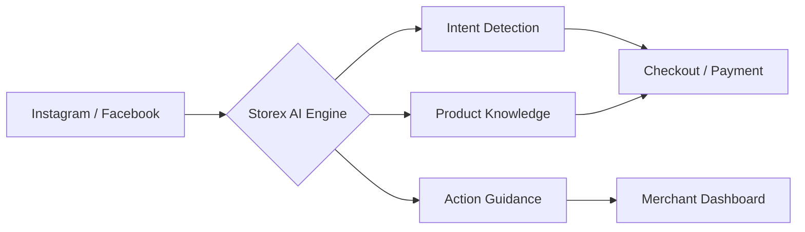

# Storex AI — Танилцуулга

  
  
  # Storex AI: Intelligence-Driven Commerce
  **Нийгмийн сүлжээний яриаг борлуулалт болгон хувиргах AI туслах — Ухаалаг, хурдтай, премиум**

---

## ⚡ Vision: AI-First Commerce

Storex бол зүгээр нэг чатбот биш. Энэ бол таны бизнесийн **AI Sales Person** буюу хиймэл оюун ухаант шилдэг борлуулагч юм. Бид "AI-First" зарчмыг баримтлан, бизнесийн операторуудын ачааллыг 90% хөнгөвчилж, үйлчүүлэгчдэд хэдхэн секундэд хариу өгөх, худалдан авалт хийх премиум туршлагыг санал болгодог.

---

## 🧠 Action Guidance System (AGS)

Storex-ийн хамгийн гол хүчин чадал нь **Action Guidance System** юм. Энэ нь борлуулагчийн "тархи" болж ажиллана:

- **Proactive Sales**: Хэрэглэгч асуухыг хүлээх биш, ярианы нөхцөл байдалд тулгуурлан бүтээгдэхүүн санал болгож, худалдан авалт руу хөтөлнө.
- **Dynamic Tasking**: Борлуулагчид тухайн өдөр, долоо хоногт хийх ёстой хамгийн чухал үйлдлүүдийг (захиалга баталгаажуулах, бараа нэмэх, зөвлөгөө хэрэгжүүлэх) AI-аар үүсгэж өгнө.
- **Merchant Insights**: Бизнесийн өсөлтөд нөлөөлөх стратегийн зөвлөмжүүдийг өгөгдөл дээр үндэслэн санал болгоно.

---

## 💎 Design Philosophy: Storex Quartz

Бидний дизайн систем болох **Storex Quartz** нь орчин үеийн, премиум мэдрэмжийг төрүүлдэг:

- **Glassmorphism**: Цэвэрхэн, тунгалаг, шилэн эффект бүхий картууд.
- **Lime Accent (#EDFF8C)**: AI болон үйлдлийн гол төвлөрөл болох өнгө.
- **Manrope Typography**: Орчин үеийн, уншихад хялбар, цэгцтэй фонт.
- **Premium Geometry**: 40px хүртэлх зөөлөн булангууд болон агаар сэлгэлт сайтай зай (spacing).
- **Subtle Micro-animations**: AI-ийн "тархи" ажиллаж буйг илтгэх зөөлөн лугшилт болон шилжилтүүд.

---

## 🚀 Гол давуу талууд

### Борлуулагчдад зориулсан
| Онцлог | Ашиг тус |
|---------|----------|
| **24/7 AI Sales Person** | Таныг унтаж байхад ч харилцааг борлуулалт болгон хувиргана. |
| **Command Center** | Бүх захиалга, яриа, барааг нэг дороос удирдах ухаалаг хяналтын самбар. |
| **Built-in Payments** | Банк болон BNPL (зээлээр авах) системүүд шууд нэгдсэн. |
| **Zero Setup Friction** | 5 минутын дотор AI-гаа сургаж, борлуулалтаа эхлэх боломжтой. |

### Үйлчлүүлэгчдэд зориулсан
| Онцлог | Ашиг тус |
|---------|----------|
| **Instant Gratification** | Ямар ч хүлээлтгүй, шууд хариу болон зөвлөгөө. |
| **In-Conversation Checkout** | Ярианы явцдаа төлбөрөө төлж, захиалгаа баталгаажуулах хялбар арга. |
| **AI Personalization** | Зөвхөн тэр хэрэглэгчид тохирсон бүтээгдэхүүн, урамшуулал. |

---

## 🏗️ Архитектур: Social-First

---

## 📖 Баримт бичгийн бүтэц

| Баримт | Агуулга |
|--------|---------|
| **INTRODUCTION.md** | Vision, AGS болон дизайны философи. |
| **BRAND_GUIDELINES.md** | Storex Quartz дизайн систем, өнгө, фонт. |
| **01_product_core.md** | Бүтээгдэхүүний үндсэн логик, чиг үүрэг. |
| **04_state_machine.md** | Системийн төлөвүүд болон шилжилтүүд. |
| **10_tech_arch_conventions.md** | Техникийн стандарт, архитектур. |

---

## 💡 Philosophy
> **Storex doesn't replace merchants. It amplifies them.**  
> **Борлуулалт бүр ярианаас эхэлдэг. Яриа бүр боломж юм.**

---

**Хувилбар**: 2.0  
**Шинэчлэгдсэн**: 2026-01-21  
**Статус**: Production-Ready Introduction
